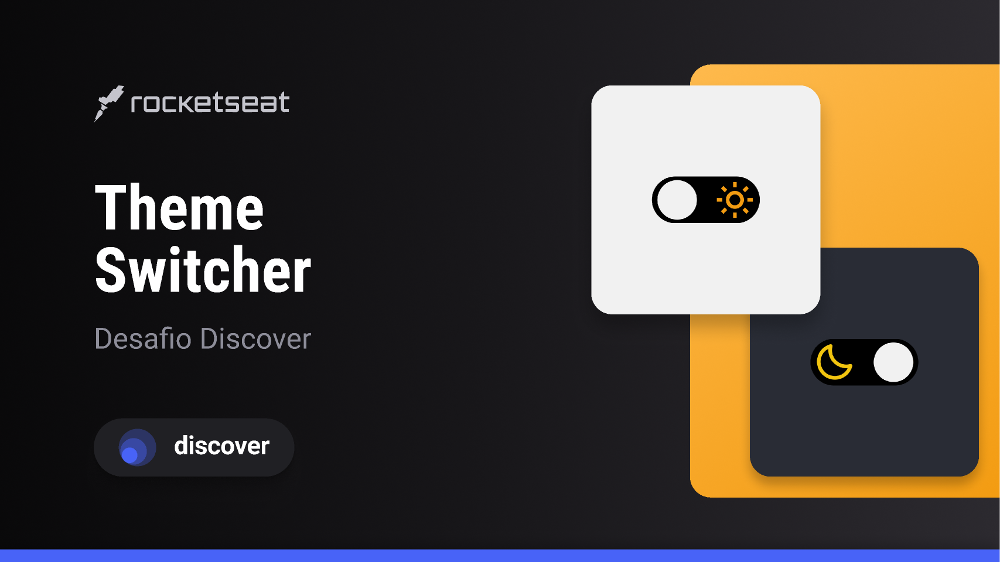

<h1 align="center"> Theme Switcher </h1>

Desafio - Discover.

  <a href="#-tecnologias">Tecnologias</a>&nbsp;&nbsp;&nbsp;|&nbsp;&nbsp;&nbsp;
  <a href="#-layout">Layout</a>&nbsp;&nbsp;&nbsp;|&nbsp;&nbsp;&nbsp;
  <a href="#memo-licença">Licença</a>

  

 

  

## 🚀 Tecnologias

Esse projeto foi desenvolvido com as seguintes tecnologias:

-   HTML e CSS
-   Git e Github
-   Figma
-   Responsividade

## 🔖 Layout

Gostaria de informar que o layout do projeto no Figma não está disponível publicamente, pois o acesso é exclusivo para os alunos.

## :memo: Licença

Esse projeto está sob a licença MIT.

---

